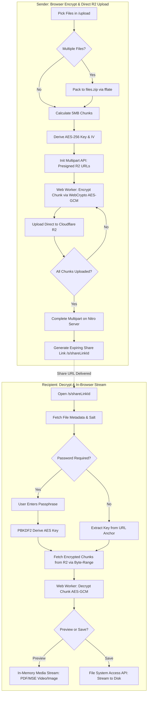

# Send Digital Covet: UI/UX Design System & Implementation Plan

> **Assumptions:**
> - The primary brand identity follows Digital Covet's official guidelines (Brand Red `#c2202d`, Dark Base Near Black `#333132`, Soft Gray `#eae8e9`, with Jost for headings and Rubik for UI copy).
> - SolidStart 2.0 uses `@ark-ui/solid` for accessible headless primitives, `lucide-solid` for iconography, and Tailwind CSS v4 CSS-first styling.
> - The application operates in zero-knowledge mode: the server never sees unencrypted file bytes or plaintext decryption passphrases.
> - Client-side cryptography is offloaded to a dedicated Web Worker running native Web Cryptography (`crypto.subtle`) to guarantee a 60fps main UI thread during 5 MB chunk processing.
> - The route `/recieve.tsx` is an inbound vault index tracking transfers shared with the user's IAM email/identifier.

**Inputs:**
- **Product Concept:** Zero-knowledge browser-encrypted file sharing with direct-to-R2 presigned multipart uploads, expiring links, chunked streaming decryption, and in-browser previews.
- **Target Audience:** Security-conscious professionals, creative agencies, legal/financial advisors, and digital teams sharing confidential deliverables.
- **Platform & Stack:** Web App (SolidStart `2.0.0-alpha.2`, SolidJS `^1.9.5`, Vite `^7`, Nitro, Tailwind CSS `^4`, `@ark-ui/solid`, `lucide-solid`, Better Auth `^1.6`, Prisma `^7`).
- **Brand Attributes:** Authoritative, Cryptographically Transparent, Razor-Sharp, Uncompromisingly Functional.

---

## 1. Strategic Design Direction & Trend Fit

### Primary Paradigm
**Swiss / International Precision fused with Minimalist Data-Density**. 
Zero-knowledge software cannot afford visual ambiguity or decorative indulgence. Trust in client-side encryption is built through mathematical transparency: visible chunk pipelines, deterministic cryptographic fingerprints, explicit authenticated data (AAD) confirmation, and unambiguous link time-to-live (TTL) counters. The aesthetic leans on the structural discipline of Swiss typography (high-contrast Jost display type, tight baseline grids, architectural dividers) and the operational telemetry of high-density developer tools.

### Category Benchmarks & Patterns Borrowed
1. **Wormhole (`wormhole.app`):** Instant drag-and-drop staging and immediate client-side key generation. Borrowed: *Instant staged state with dual-action link copy before upload finishes.*
2. **Proton Drive / Tresorit:** Explicit cryptographic status verification badges and zero-knowledge telemetry. Borrowed: *Inspectable security summary modal (AES-256-GCM cipher, PBKDF2 iterations, AAD payload).*
3. **Linear:** Keyboard ergonomics, dense data tables with mono-aligned tabular metrics, and low-friction inline actions. Borrowed: *Dashboard table structure, contextual hover actions, and keyboard-first link management.*
4. **WeTransfer:** Uncluttered staging card for transfer packaging. Borrowed: *Focused two-column upload architecture (payload inspector vs. link security parameters).*

### Experience Mode per Surface

| Surface | Mode | Rationale |
|---|---|---|
| **Public Download (`/s/[shareLinkId]`)** | **Expressive** | Recipient may not be a Digital Covet user; requires brand authority, instant trust signals, and clear decryption progress feedback. |
| **Upload Engine (`/upload`)** | **Utility** | High-focus workspace for multi-file staging, ZIP packaging, and chunk-by-chunk cryptographic pipeline inspection. |
| **File Management (`/dashboard`)** | **Utility** | Operational monitoring: expiry dates, download quotas, instant revocation, and transfer telemetry. |
| **Inbound Vault (`/recieve`)** | **Utility** | Fast scanning, status sorting, and one-click decryption/streaming saves of inbound transfers. |
| **Authentication (`/auth/login`)** | **Expressive** | Enterprise OIDC handoff; communicates single sign-on security via Digital Covet IAM. |

### Signature Elements (Domain-Derived)

1. **Cryptographic Chunk Block Matrix (`ChunkMatrix`)**
   - *Domain Source:* The 5 MB chunk slicing and AES-256-GCM authenticated encryption loop (`{ fileId, chunkIndex, totalChunks }`).
   - *Spec:* A discrete horizontal grid of 6×12px monospace micro-blocks. Each block transitions through four discrete states: `Staged` (neutral border), `Encrypting` (amber pulse), `Uploading` (brand red sweep), and `Committed` (solid emerald or dark charcoal).
   - *Meaning & Fit:* Provides literal, verifiable proof that files are processed in isolated blocks client-side. Appears on `/upload` and `/s/[shareLinkId]`. Never used on general data tables or settings.
   - *Implementation:* Lightweight SVG `<rect>` elements driven by SolidJS signals with `aria-hidden="true"`.

2. **The Covet Security Notch (`VaultNotch`)**
   - *Domain Source:* Physical micro-cassette write-protect tabs and safe-deposit seal cuts, echoed by Digital Covet’s angular geometric brand language.
   - *Spec:* A precision 45-degree chamfered corner (12px diagonal cut) on the top-right of primary cards and modals, framed with a 1px border (`--border-subtle`) and an accent red anchor tick `#c2202d`.
   - *Meaning & Fit:* Communicates tamper-evident enclosure. Used on upload configuration cards, public recipient file cards, and modal dialogs. Never applied to standard table rows or nested inputs.

3. **PBKDF2 Key Fingerprint Chip (`KeyFingerprint`)**
   - *Domain Source:* Truncated SHA-256 hash digests and salt fingerprints derived during client-side key derivation.
   - *Spec:* An inline mono badge (`font-mono text-[11px]`) containing the first and last 4 characters of the key identifier (e.g., `SHA256: 7f2a…9e01`), flanked by an iconified lock glyph and a green verification dot.
   - *Meaning & Fit:* Visible proof of zero-knowledge client execution. Sits inside the upload summary, link creation receipt, and recipient decryption stage.

4. **Ephemeral Decay Progress Bar (`TtlDecayRule`)**
   - *Domain Source:* Time-limited cryptographic validity windows (24h / 7d / 30d TTLs).
   - *Spec:* A 2px high hairline divider under card headers or table rows that transitions from solid Brand Red `#c2202d` to a dashed `#eae8e9` path, proportional to the link's remaining lifespan.
   - *Meaning & Fit:* Instantly communicates urgency and impending data death without requiring mental date math.

### Product-Specific Anti-Patterns to Avoid
1. **Indefinite Spinners on Crypto Operations:** Never show a spinning circle during client-side encryption. A 1 GB multi-file archive takes 4–8 seconds to package and encrypt; an indefinite spinner reads as a frozen browser. Use the deterministic `ChunkMatrix`.
2. **"Password Validated" Server Leaks:** Never validate share passwords on keyup via API. Password validation occurs entirely client-side when the PBKDF2-derived key successfully decrypts chunk 0's GCM authentication tag.
3. **Floating "Cyber-Security" Particles:** No particle networks, matrix rain, or glowing neon shields. They read as novelty templates and damage enterprise credibility.
4. **Scroll-Jacking on File Delivery:** `/s/[shareLinkId]` is a critical utility. Decryption and downloading must happen without hijacked scroll wheels or gratuitous scroll-linked scenes.

---

## 2. Visual Language & Ergonomics

### Color Palette & Contrast Audit

```
WCAG 2.1 Verification Matrix:
- `#FFFFFF` on Brand Red `#c2202d`       :  5.44:1 (Passes AA Normal, AAA Large)
- White `#FFFFFF` on Dark Base `#333132`  : 12.98:1 (Passes AAA Normal)
- Charcoal `#4a4748` on White `#FFFFFF`   :  8.16:1 (Passes AAA Normal)
- Dark Red `#9c1924` on White `#FFFFFF`   :  7.78:1 (Passes AAA Normal)
- Soft Gray `#eae8e9` on Dark Base `#333132`: 10.57:1 (Passes AAA Normal)
- Dark Mode Card `#252425` on `#FFFFFF`   : 14.88:1 (Passes AAA Normal)
- Cyber Coral `#FF616E` on `#252425`      :  4.58:1 (Passes AA Normal)
```

#### Core Palette (5 Required Surfaces)

| Role | Token | Light Mode Hex | Dark Mode Hex | Usage & Verified Contrast |
|---|---|---|---|---|
| **Primary** | `--color-primary` | `#c2202d` | `#e0313f` | Brand Red. Primary buttons, active tabs, upload triggers. Text on Primary is `#FFFFFF` (5.44:1, AA). |
| **Secondary** | `--color-secondary` | `#333132` | `#F6F5F5` | Dark Base. High-contrast display headings, primary body copy, solid button alternate. 12.98:1 on light surface (AAA). |
| **Accent** | `--color-accent` | `#9c1924` | `#FF616E` | Red Dark / Cyber Coral. Interactive text links, cryptographic badges, active focus rings. 7.78:1 on light (AAA); 4.58:1 on dark (AA). |
| **Background / Canvas** | `--color-background` | `#eae8e9` | `#181718` | Soft Gray canvas. Low-strain perimeter framing application cards. |
| **Surface / Card** | `--color-surface` | `#FFFFFF` | `#252425` | Pure White / Muted Charcoal elevated cards, toolbars, data tables, and input fields. |

#### Semantic Status Palette

| State | Light Hex | Dark Hex | Icon Pair (WCAG 1.4.1 non-color indicator) | Verified Ratio vs Surface |
|---|---|---|---|---|
| **Success / Committed** | `#15803d` | `#4ade80` | `CheckCircle2` | 4.82:1 (Light) / 9.12:1 (Dark) — AA Pass |
| **Warning / Consumed** | `#b45309` | `#fbbf24` | `AlertTriangle` | 4.61:1 (Light) / 8.74:1 (Dark) — AA Pass |
| **Error / Revoked** | `#9c1924` | `#f87171` | `AlertOctagon` | 7.78:1 (Light) / 6.20:1 (Dark) — AAA Pass |
| **Info / Encrypting** | `#1d4ed8` | `#60a5fa` | `ShieldAlert` | 5.12:1 (Light) / 7.45:1 (Dark) — AA Pass |

*Accessibility Rule:* No status relies on hue alone. Every file state displays both an icon and an uppercase semantic label (`ACTIVE`, `CONSUMED`, `REVOKED`, `EXPIRED`).

### Surface Elevation Levels

```
Level 0 (Canvas)   : Light #eae8e9 | Dark #181718 | Border: none
Level 1 (App Shell): Light #F7F6F7 | Dark #1E1C1D | Border: 1px solid var(--border-subtle)
Level 2 (Cards)    : Light #FFFFFF | Dark #252425 | Border: 1px solid var(--border-subtle) | Shadow: 0 1px 3px rgba(51,49,50,0.06)
Level 3 (Popovers) : Light #FFFFFF | Dark #2C2A2B | Border: 1px solid var(--border-strong) | Shadow: 0 10px 25px -5px rgba(51,49,50,0.18)
```

### Typography Scale (Major Third — 1.25)
Following Digital Covet Brand Guidelines: Display/Headings in **Jost**; Body & Form UI in **Rubik**; Cryptographic Telemetry in **JetBrains Mono**.

| Role | Font Family | Size (rem/px) | Weight | Tracking | Line Height | Usage |
|---|---|---|---|---|---|---|
| **Hero Display** | Jost | `2.441rem` / 39px | 800 (ExtraBold) | `-0.03em` | 1.15 | Public recipient title, login hero headline |
| **Heading 1** | Jost | `1.953rem` / 31px | 800 (ExtraBold) | `-0.02em` | 1.20 | Primary page titles (`/dashboard`, `/upload`) |
| **Heading 2** | Jost | `1.563rem` / 25px | 700 (Bold) | `-0.01em` | 1.25 | Card group headers, modal titles |
| **Heading 3** | Jost | `1.250rem` / 20px | 600 (SemiBold) | `0.00em` | 1.30 | Section dividers, file name headers |
| **Body (Default)** | Rubik | `1.000rem` / 16px | 400 (Regular) | `0.00em` | 1.65 | Primary paragraph copy, form descriptions |
| **Body Small** | Rubik | `0.875rem` / 14px | 400 / 500 (Med) | `0.00em` | 1.50 | Table cell text, tooltips, list meta |
| **Label / Category**| Rubik | `0.750rem` / 12px | 500 (Medium) | `+0.12em` | 1.00 | ALL CAPS status badges, section tags |
| **Crypto Telemetry**| JetBrains Mono | `0.8125rem` / 13px | 500 (Medium) | `-0.01em` | 1.40 | Hashes, chunk counters, AAD bytes, UUIDs |

### Iconography & Imagery
- **Package:** `lucide-solid` (native SolidJS tree-shakeable components).
- **Stroke Width:** `1.75px` across all sizes for razor-sharp geometric alignment with Jost.
- **Sizing Hierarchy:** `14px` (inline meta/badges), `18px` (button icons, table row actions), `22px` (navigation rail, card headers), `40px` (dropzone empty state).
- **Mandatory Icon Placements:** Every sidebar navigation item, primary action button, status badge, and file-type indicator (`FileArchive`, `FileImage`, `FileText`, `FileVideo`, `FileSpreadsheet`).

### Layout & Spacing
- **Container Widths:** Main workspace capped at `1280px` (`max-w-7xl`), centered with fluid horizontal padding (`px-4` sm, `px-8` lg).
- **Asymmetric Proportions:**
  - *Upload View (`/upload`):* 400px fixed configuration panel + fluid staging canvas (approx 65/35 split).
  - *Public Download (`/s/[shareLinkId]`):* Centered 540px fixed-width cryptographic card.
  - *Dashboard (`/dashboard`):* 260px collapsible sidebar + fluid data table.
- **Touch Targets:** All interactive triggers, buttons, and switches meet the minimum 44×44px hit-box rule via invisible pseudo-padding on desktop and explicit touch heights on mobile (`min-h-[44px]`).

### Complete Design Tokens Block

```css
/* ==========================================================================
   DIGITAL COVET DESIGN SYSTEM TOKENS (Tailwind v4 @theme inline)
   ========================================================================== */

:root {
  /* Brand Core */
  --color-primary: #c2202d;
  --color-primary-hover: #9c1924;
  --color-primary-active: #7a121b;
  --color-primary-tint: rgba(194, 32, 45, 0.08);

  --color-secondary: #333132;
  --color-secondary-hover: #242223;
  --color-charcoal: #4a4748;

  --color-accent: #9c1924;
  --color-accent-subtle: #d93040;

  /* Surfaces & Canvas */
  --color-background: #eae8e9;
  --color-surface: #ffffff;
  --color-surface-subtle: #f7f6f7;
  --color-surface-elevated: #ffffff;

  /* Borders & Dividers */
  --color-border: #dcd8da;
  --color-border-subtle: #eae6e8;
  --color-border-strong: #333132;

  /* Typography Colors */
  --color-text-main: #333132;
  --color-text-muted: #5e5b5c;
  --color-text-inverse: #ffffff;

  /* Semantic Feedback */
  --color-success: #15803d;
  --color-success-tint: rgba(21, 128, 61, 0.08);
  --color-warning: #b45309;
  --color-warning-tint: rgba(180, 83, 9, 0.08);
  --color-error: #9c1924;
  --color-error-tint: rgba(156, 25, 36, 0.08);
  --color-info: #1d4ed8;
  --color-info-tint: rgba(29, 78, 216, 0.08);

  /* Geometry & Layout */
  --sidebar-width: 260px;
  --sidebar-rail-width: 68px;
  --header-height: 64px;
  --radius-sm: 2px;
  --radius-md: 4px;
  --radius-lg: 8px;

  /* Motion & Timings */
  --duration-instant: 75ms;
  --duration-fast: 150ms;
  --duration-normal: 250ms;
  --duration-slow: 400ms;
  --ease-sharp: cubic-bezier(0.16, 1, 0.3, 1);
  --ease-standard: cubic-bezier(0.2, 0, 0, 1);
}

.dark {
  --color-primary: #e0313f;
  --color-primary-hover: #c2202d;
  --color-primary-active: #9c1924;
  --color-primary-tint: rgba(224, 49, 63, 0.15);

  --color-secondary: #f7f6f7;
  --color-secondary-hover: #ffffff;
  --color-charcoal: #a19d9e;

  --color-accent: #ff616e;
  --color-accent-subtle: #e0313f;

  --color-background: #181718;
  --color-surface: #252425;
  --color-surface-subtle: #1e1c1d;
  --color-surface-elevated: #2c2a2b;

  --color-border: #383536;
  --color-border-subtle: #2b292a;
  --color-border-strong: #615d5e;

  --color-text-main: #f7f6f7;
  --color-text-muted: #a19d9e;
  --color-text-inverse: #181718;

  --color-success: #4ade80;
  --color-success-tint: rgba(74, 222, 128, 0.15);
  --color-warning: #fbbf24;
  --color-warning-tint: rgba(251, 191, 36, 0.15);
  --color-error: #f87171;
  --color-error-tint: rgba(248, 113, 113, 0.15);
  --color-info: #60a5fa;
  --color-info-tint: rgba(96, 165, 250, 0.15);
}

@theme inline {
  --color-primary: var(--color-primary);
  --color-primary-hover: var(--color-primary-hover);
  --color-primary-tint: var(--color-primary-tint);

  --color-secondary: var(--color-secondary);
  --color-charcoal: var(--color-charcoal);

  --color-accent: var(--color-accent);

  --color-background: var(--color-background);
  --color-surface: var(--color-surface);
  --color-surface-subtle: var(--color-surface-subtle);
  --color-surface-elevated: var(--color-surface-elevated);

  --color-border: var(--color-border);
  --color-border-subtle: var(--color-border-subtle);
  --color-border-strong: var(--color-border-strong);

  --color-text-main: var(--color-text-main);
  --color-text-muted: var(--color-text-muted);

  --color-status-success: var(--color-success);
  --color-status-warning: var(--color-warning);
  --color-status-error: var(--color-error);
  --color-status-info: var(--color-info);

  --font-display: "Jost", -apple-system, BlinkMacSystemFont, "Segoe UI", sans-serif;
  --font-sans: "Rubik", -apple-system, BlinkMacSystemFont, "Segoe UI", sans-serif;
  --font-mono: "JetBrains Mono", ui-monospace, SFMono-Regular, Menlo, monospace;

  --radius-sm: var(--radius-sm);
  --radius-md: var(--radius-md);
  --radius-lg: var(--radius-lg);

  --width-sidebar: var(--sidebar-width);
  --width-sidebar-rail: var(--sidebar-rail-width);
}
```

---

## 3. Motion & Immersion Strategy (Necessity Analysis)

### Tier Verdicts

| Animation Tier | Verdict | Surface Application | Justification & Budget Impact |
|---|---|---|---|
| **1. Micro-interactions & UI Transitions** | **YES** | **All Surfaces** | Confirms state changes, validates inputs, and ensures responsive feedback. Uses hardware-accelerated CSS transforms. Zero JS bundle penalty. |
| **2. Scroll-Linked Choreography** | **NO** | **None** | Anti-pattern for secure workflows. Dragging files, monitoring crypto workers, or downloading multi-gigabyte archives must never be tied to scroll offsets. |
| **3. Interactive Vector (Lottie/Rive)** | **SELECTIVE** | **Public Recipient & Upload Success** | A single lightweight (<18 KB) vector sequence representing cryptographic sealing ("Vault Secured"). Pauses immediately after 1 cycle (WCAG 2.2.2 compliance). |
| **4. High-Fidelity 3D (Three.js/WebGL)** | **NO** | **None** | Completely rejected. 3D runtimes inject 500 KB+ of JavaScript, compete with the Web Cryptography Web Worker for GPU/CPU cycles, and degrade mobile battery life during client-side AES operations. |

### Resource Budgets & Ergonomic Guardrails
- **Main Thread Budget:** Frame budget is 16.6ms (60fps). All AES-256-GCM chunk processing and `fflate` compression operate in a dedicated Web Worker (`/workers/crypto-worker.ts`), preventing UI thread jank.
- **Reduced Motion Path:** When `prefers-reduced-motion: reduce` is detected:
  - All transition durations drop to `0ms`.
  - The `ChunkMatrix` switches from animated opacity fades to immediate solid color fills.
  - The Lottie security seal is replaced with a static SVG icon (`ShieldCheck`).

---

## 4. Animation & Interaction Blueprint

### 1. ChunkMatrix Progress Pipeline
- **Trigger & Behavior:** Driven by messages from the Crypto Web Worker as each 5 MB block transitions from `READING` -> `ENCRYPTED` -> `UPLOAD_PART_COMMITTED`.
- **Duration & Curve:** 150ms per chunk block state transition; `cubic-bezier(0.16, 1, 0.3, 1)`.
- **Cognitive Purpose:** Confirms to the user that their data is actively undergoing transformation before network transmission.
- **Reduced Motion:** Blocks update state instantly without pulse or background sweep.

### 2. Ephemeral TTL Expiry Pulse
- **Trigger & Behavior:** When a link reaches the final 60 minutes of its lifespan on `/dashboard` or `/s/[shareLinkId]`.
- **Duration & Curve:** 2000ms infinite subtle pulse on the remaining status indicator (opacity shifts between 1.0 and 0.65).
- **Cognitive Purpose:** Peripheral awareness of impending link revocation without intrusive modal alerts.
- **Reduced Motion:** Static Warning Amber badge with no pulsing opacity.

### 3. Password Verification Shake & Decrypt Reveal
- **Trigger & Behavior:** Form submission on `/s/[shareLinkId]`. If decryption of chunk 0's GCM authentication tag fails: 400ms horizontal shake (`-6px` to `+6px` 4 cycles) with red border transition. On success: 200ms ease-out crossfade to the decrypted preview panel.
- **Duration & Curve:** Error: 400ms ease-in-out; Success: 200ms ease-out.
- **Cognitive Purpose:** Clear tactile feedback distinguishing between an incorrect password and a network transmission fault.
- **Reduced Motion:** Immediate text error message ("Decryption failed: invalid passphrase"); zero positional shaking.

### 4. Sidebar Expansion & Collapsible Rail
- **Trigger & Behavior:** Clicking the sidebar toggle button or pressing `[` shortcut.
- **Duration & Curve:** 180ms ease-in-out transition between `260px` and `68px`. Nav labels fade out in 60ms, then the container shrinks.
- **Cognitive Purpose:** Reclaims horizontal workspace for large file tables without disorienting navigation context.
- **Reduced Motion:** Instant width swap; no transitional width interpolations.

---

## 5. Technical Implementation Roadmap

### Production Stack & Exact Packages
- **Framework:** SolidStart `2.0.0-alpha.2` + SolidJS `^1.9.5`
- **Build / Server:** Vite `^7`, Nitro (Vercel edge/node preset)
- **Styling:** Tailwind CSS `^4` (CSS-first `@import "tailwindcss";`, `@theme inline`)
- **UI Primitives:** `@ark-ui/solid` (Tabs, Dialog, Popover, Menu, Tooltip, Progress, SegmentGroup)
- **Icons:** `lucide-solid`
- **Data & Auth:** Prisma `^7` (`@prisma/adapter-pg`), Better Auth `^1.6` (`genericOAuth`)
- **Crypto & Pipeline:** Native Web Cryptography API (`window.crypto.subtle`), `fflate` `^0.8.2`
- **Cloud Storage:** `@aws-sdk/client-s3` (R2 multipart presigned URLs: `CreateMultipartUploadCommand`, `UploadPartCommand`, `CompleteMultipartUploadCommand`)
- **Code Hygiene:** Biome `2.4.16`, TypeScript `^6`

### Performance & Security Budgets
- **Total Initial JS Bundle:** `< 85 KB` gzipped (excluding Web Worker). SolidJS's fine-grained reactivity eliminates the virtual DOM overhead.
- **Core Web Vitals:** LCP `< 1.2s`, INP `< 50ms`, CLS `0.00`.
- **Content Security Policy (SolidStart Middleware):**
  ```http
  Content-Security-Policy: default-src 'self'; script-src 'self' 'wasm-unsafe-eval'; worker-src 'self' blob:; connect-src 'self' https://*.r2.cloudflarestorage.com; img-src 'self' blob: data:; style-src 'self' 'unsafe-inline'; frame-ancestors 'none';
  ```

### Code Skeleton: Cryptographic Chunk Matrix Component (`@ark-ui/solid`)

```tsx
// src/components/crypto/ChunkMatrix.tsx
import { For, Show, createMemo } from "solid-js";
import { Progress } from "@ark-ui/solid";
import { ShieldCheck, ShieldAlert, Cpu } from "lucide-solid";

export type ChunkStatus = "pending" | "encrypting" | "uploading" | "committed" | "failed";

export interface ChunkMatrixProps {
  totalChunks: number;
  chunkStates: ChunkStatus[];
  currentSpeedMbps: number;
  fileName: string;
}

export function ChunkMatrix(props: ChunkMatrixProps) {
  const committedCount = createMemo(() => 
    props.chunkStates.filter((s) => s === "committed").length
  );
  
  const percentComplete = createMemo(() => 
    props.totalChunks > 0 ? Math.round((committedCount() / props.totalChunks) * 100) : 0
  );

  return (
    <div class="w-full bg-surface border border-border p-5 rounded-md shadow-xs">
      <div class="flex items-center justify-between mb-3">
        <div class="flex items-center gap-2">
          <Cpu class="w-4 h-4 text-primary" />
          <span class="font-display font-bold text-sm text-text-main tracking-tight">
            AES-256-GCM CHUNK PIPELINE
          </span>
          <span class="font-mono text-xs text-text-muted">
            ({props.totalChunks} × 5 MB blocks)
          </span>
        </div>
        <div class="flex items-center gap-3">
          <span class="font-mono text-xs font-medium text-text-muted">
            {props.currentSpeedMbps.toFixed(1)} MB/s
          </span>
          <span class="font-mono text-xs font-bold text-primary">
            {percentComplete()}%
          </span>
        </div>
      </div>

      {/* Discrete 5 MB Chunk Matrix */}
      <div 
        class="grid gap-1 py-2 max-h-36 overflow-y-auto scrollbar-thin"
        style={{
          "grid-template-columns": "repeat(auto-fill, minmax(12px, 1fr))"
        }}
        role="progressbar"
        aria-valuenow={percentComplete()}
        aria-valuemin="0"
        aria-valuemax="100"
        aria-label={`Encryption progress for ${props.fileName}`}
      >
        <For each={props.chunkStates}>
          {(status, index) => (
            <div
              class="h-3 rounded-[1px] transition-colors duration-fast motion-reduce:transition-none"
              classList={{
                "bg-border-subtle": status === "pending",
                "bg-status-warning animate-pulse": status === "encrypting",
                "bg-primary": status === "uploading",
                "bg-status-success": status === "committed",
                "bg-status-error": status === "failed",
              }}
              title={`Chunk ${index() + 1} of ${props.totalChunks}: ${status}`}
            />
          )}
        </For>
      </div>

      {/* Cryptographic Footprint Telemetry */}
      <div class="mt-3 pt-3 border-t border-border-subtle flex items-center justify-between text-xs text-text-muted">
        <div class="flex items-center gap-1.5 font-mono text-[11px]">
          <span class="w-2 h-2 rounded-full bg-status-success inline-block" />
          <span>AAD: fileId || chunkIndex || totalChunks</span>
        </div>
        <span class="font-mono text-[11px]">
          {committedCount()} / {props.totalChunks} COMMITTED
        </span>
      </div>
    </div>
  );
}
```

---

## 6. App Shell & Page-by-Page UX Specification

> **How to build from this section.** Implement each page from its **component blueprint**, using the named components, variants and tokens from Sections 2 and 5. Proportion sketches show only relative size and position: do not reproduce their borders, box-drawing characters, monospace text or labels. Every app page renders inside the **App Shell** below, even though page blueprints omit it. Decorative elements appear in blueprints as `Decor` nodes and are specified in each page's **Decoration** field and in the decoration map; build them as specified and add no decoration that isn't listed. Copy in quotation marks is final UI text; everything else is description.

### 6.1 Page Inventory

| Page | Route | Purpose | Mode | Priority | Nav Placement | Main Data / Endpoints |
|---|---|---|---|---|---|---|
| **Secure Upload** | `/upload` | Stage files, zip archives, encrypt client-side, upload to R2 | Utility | Core | Primary Nav | `POST /api/files/init-multipart`, `POST /api/files/complete` |
| **Dashboard** | `/dashboard` | File lifecycle management, edit expiry, view access metrics | Utility | Core | Primary Nav | `GET /api/files`, `PATCH /api/share-links/[id]`, `DELETE /api/files/[id]` |
| **Inbound Vault** | `/recieve` | Track files shared with recipient's OIDC email | Utility | Core | Primary Nav | `GET /api/shared/inbound` |
| **Public Download** | `/s/[shareLinkId]` | Recipient decryption, streaming range requests, preview | Expressive | Core | None (Public) | `GET /api/shared/[id]/meta`, `GET /api/shared/[id]/chunk-urls` |
| **OAuth Login** | `/auth/login` | Digital Covet IAM OIDC single sign-on handoff | Expressive | Core | None (Auth) | Better Auth `genericOAuth` initiation endpoints |
| **Account Settings** | `/settings` *(inferred)* | IAM session keys, storage consumption, security logs | Utility | Supporting | User Menu | `GET /api/user/me`, `GET /api/user/storage-quota` |
| **Expired / 410 State** | `/s/[shareLinkId]` *(error)* | Expired, consumed, or revoked file notification | Utility | Utility | None (Error) | Returns HTTP 410 Gone with clean tombstone UX |

---

### 6.2 App Shell & Navigation

```
AppShell
├─ Sidebar (260px · collapsible → 68px rail < 1280px · Sheet drawer < 768px · bg surface-subtle)
│  ├─ SidebarHeader
│  │  ├─ BrandLogo: CovetMark ("SEND" badge in Jost 800 Brand Red)
│  │  └─ Button collapse/expand ("[" shortcut hint in Tooltip)
│  ├─ ActionButton: Link to "/upload" (variant primary · "Encrypt & Send" · icon ShieldAlert)
│  ├─ SidebarGroup "WORKSPACES"
│  │  ├─ NavItem "Upload Files"      (/upload)   icon UploadCloud
│  │  ├─ NavItem "Active Shares"     (/dashboard) icon HardDrive     badge Count
│  │  └─ NavItem "Inbound Vault"     (/recieve)   icon InboxDown     badge Unread
│  ├─ SidebarGroup "SYSTEM INTEGRITY"
│  │  ├─ SecurityChip: "Zero-Knowledge Active" (icon Lock · status dot emerald)
│  │  └─ StorageQuota: "4.2 GB of 50 GB used" (Ark Progress meter)
│  └─ SidebarFooter:
│     ├─ Link "Documentation" (/docs) icon FileText
│     └─ UserMenu (Avatar · Name from IAM · ChevronsUpDown · Popover Menu)
└─ Main (fluid · max-w-7xl centered · px-4 md:px-8 · py-6)
   ├─ GlobalPageHeader: Title · Status Badges · Context Actions Right
   └─ Page Content Outlet
```

---

### 6.3 Decoration Map

| Page | Intensity | Elements | Anchored To | Appears in States | Motion | Job It Does |
|---|---|---|---|---|---|---|
| **Secure Upload (`/upload`)** | **Accent** | `VaultNotch`, `ChunkMatrix`, `KeyFingerprint` | Staging Card corner, Upload Progress Panel, Key Derivation summary | Staging, Active Upload, Success | ChunkMatrix reactive sweep | Validates zero-knowledge boundaries and provides visible proof of block cipher execution. |
| **Dashboard (`/dashboard`)** | **Trace** | `TtlDecayRule`, `VaultNotch` | Table row bottom border, Revoke Confirmation modal | Default rows, Expiring rows | Pulse when TTL < 60m | Provides clear peripheral perception of time decay without cluttering file tables. |
| **Inbound Vault (`/recieve`)** | **Trace** | `VaultNotch`, `KeyFingerprint` | Filter bar edge, Decryption drawer | Default, Decrypting | Static | Signals cryptographic integrity of inbound sender payloads. |
| **Public Download (`/s/[id]`)** | **Feature** | `VaultNotch`, `ChunkMatrix`, `LottieSecuritySeal` | Main Card top-right, Decryption Progress stage, Verified Seal | Password challenge, Decrypting, Ready | 1-cycle seal reveal | Builds immediate trust for external recipients unaccustomed to browser-side zero-knowledge decryption. |
| **OAuth Login (`/auth/login`)** | **Accent** | `VaultNotch`, Background Security Grid | Main IAM Auth Card, Viewport background | Default | Static | Reinforces Digital Covet enterprise security posture. |
| **Expired Link (`/s/[id]` 410)** | **Trace** | Tombstone border stamp | Error Card header | Permanent | Static | Clear, dignified explanation that file bytes were permanently purged from R2 storage. |

---

### 6.4 Page-by-Page UX Specifications

#### 1. Secure Upload — `/upload` · Mode: Utility · Nav: Primary

**User Goal:** Stage one or multiple files, package them into a client-side ZIP archive if needed, set link security parameters (TTL, password, download count), encrypt in the browser, and upload directly to R2.

**Entry Points:** Sidebar "Encrypt & Send" button, direct URL `/upload`, or drag-and-drop file onto any dashboard surface.

**Blueprint:**
```
PageContainer
├─ PageHeader
│  ├─ Title Jost 800 "Encrypt & Send Files"
│  └─ Subtitle Rubik "Client-side AES-256-GCM encryption with direct-to-R2 streaming."
├─ Grid (cols-1 lg:cols-12 gap-8 items-start)
│  ├─ Column Left: Staging & Chunk Telemetry (lg:col-span-7)
│  │  ├─ Card StagingArea (variant surface · border border-border · rounded-md · VaultNotch)
│  │  │  ├─ Decor VaultNotch (aria-hidden · absolute top-0 right-0 · 12px cut · border-accent)
│  │  │  ├─ Conditional: FileList empty
│  │  │  │  └─ DropZone (border-2 border-dashed border-border-strong · hover:border-primary · p-12)
│  │  │  │     ├─ Icon UploadCloud (w-12 h-12 text-primary)
│  │  │  │     ├─ Heading Jost 700 "Drag files here or browse"
│  │  │  │     ├─ Text Rubik "Multiple files are automatically bundled into an encrypted files.zip"
│  │  │  │     └─ Button variant outline "Select from Disk" (Plus icon)
│  │  │  └─ Conditional: FileList populated
│  │  │     ├─ StagedFilesList (divide-y divide-border-subtle)
│  │  │     │  └─ For each staged file
│  │  │     │     └─ StagedFileRow: Icon FileType · FileName · FileSize · Button "Remove" (Trash2)
│  │  │     ├─ StagingSummary: Total Files · Total Uncompressed Size · Output Archive Name
│  │  │     └─ Decor KeyFingerprint (aria-hidden · font-mono text-xs · bg-surface-subtle)
│  │  └─ Conditional: Upload in progress / completed
│  │     └─ ChunkMatrix Component (totalChunks, chunkStates, currentSpeedMbps, fileName)
│  └─ Column Right: Link Security Controls (lg:col-span-5)
│     ├─ Card SecuritySettings (variant surface · border border-border · p-6 · rounded-md)
│     │  ├─ Heading Jost 700 "Access Controls"
│     │  ├─ Field ExpiryDuration (Ark SegmentGroup: "24 Hours" | "7 Days" | "30 Days" | "Custom")
│     │  ├─ Field DownloadLimit (Ark NumberInput: default 1 · min 1 · max 100 · Toggle "Unlimited")
│     │  ├─ Field PasswordProtection
│     │  │  ├─ Switch Ark Switch "Require Passphrase"
│     │  │  └─ Conditional: Switch checked
│     │  │     ├─ InputPassword (Ark Input · placeholder "Enter high-entropy passphrase")
│     │  │     └─ HelperText Rubik "Key will be derived via PBKDF2 (100,000 rounds) in browser."
│     │  ├─ Divider
│     │  ├─ SecurityAuditNotice: "Zero-Knowledge Guarantee: File contents and passwords never touch Digital Covet servers."
│     │  └─ Button Primary full-width "Encrypt & Generate Link" (ShieldCheck icon · size lg)
│     └─ Conditional: Upload complete
│        └─ ShareLinkReceiptCard (border-status-success)
│           ├─ InputReadOnly ShareURL (`https://send.digitalcovet.com/s/covet-7a2b9...`)
│           ├─ Button "Copy Share URL" (Copy icon)
│           └─ Button "Copy Password" (Key icon · if set)
```

**Visual Treatment:**
- *Focal Point:* The primary drag-and-drop dropzone transforms upon file drop into the `ChunkMatrix` pipeline with high-contrast emerald and primary red blocks.
- *Surface Levels:* Canvas sits on Level 0 (`#eae8e9` / `#181718`); Staging and Configuration cards sit on Level 2 (`#FFFFFF` / `#252425`) with `1px` subtle borders.
- *Icons & Imagery:* Technical file-type glyphs (`FileArchive`, `FileImage`, `FileText`), `ShieldAlert` for encryption triggers, and `Key` for PBKDF2 settings.
- *Density & Rhythm:* 24px grid gutter between columns; inputs spaced at 16px intervals; staged file rows set at compact 48px height with tabular numeric bytes.

**Decoration:**
- *Intensity:* **Accent**
- *Elements:*
  - `VaultNotch` → Anchored to Staging Area card top-right corner; 12px chamfer cut; stroke 1px `--color-border`; red accent tick; static.
  - `ChunkMatrix` → Anchored below file list upon encryption initiation; fluid width; 12px height per block; reactive to Web Worker postMessage events; reduced motion disables pulse.
  - `KeyFingerprint` → Anchored in StagingSummary bar; mono font; `rgba(51,49,50,0.04)` fill; static.
- *Kept Clear:* File name text, password input box, and byte size indicators remain strictly unadorned.
- *Contrast:* White text on Primary Button = 5.44:1 (AA pass); dark text on card = 12.98:1 (AAA pass).

**Proportions Sketch:**
```
Proportions only — do not reproduce
┌─────────────────────────────────────────────────────────────┐
│ Page Header: Title & Zero-Knowledge Protocol Status         │
├───────────────────────────────────┬─────────────────────────┤
│ Staging Canvas & Dropzone     [1] │ Link Access Controls [2]│
│                                   │                         │
│                                   │ - Expiry Segmented Group│
│                                   │ - Download Quota Limit  │
│                                   │ - PBKDF2 Passphrase     │
├───────────────────────────────────┤                         │
│ ChunkMatrix Cryptographic Bar [3] │ [ Encrypt & Generate ]  │
└───────────────────────────────────┴─────────────────────────┘
1 60% fluid staging canvas  2 40% fixed 400px panel  3 reactive chunk pipeline
```

**Layout:** Asymmetric desktop split (approx 60/40); collapses to single stacked column below 1024px (`lg`). Left column retains full focus on file ingestion.

**States:**
- *Loading (Encrypting):* Staging inputs are disabled; `ChunkMatrix` animates with active throughput MB/s counter.
- *Empty:* Large dashed dropzone with clear file-type pills and one primary "Select from Disk" action.
- *Error:* Red toast alert if local file cannot be read or Web Worker fails memory allocation; staged files preserved.

**Accessibility:** Accessible focus ring on dropzone (keyboard `Enter` or `Space` opens native file picker); chunk matrix announces progress at 25% increments via `aria-live="polite"`.

---

#### 2. Dashboard — `/dashboard` · Mode: Utility · Nav: Primary

**User Goal:** Inspect all active, consumed, and expired transfers; modify expiration windows; revoke links immediately; review download count telemetry.

**Entry Points:** Sidebar "Active Shares", redirect after upload completion.

**Blueprint:**
```
PageContainer
├─ PageHeader
│  ├─ Title Jost 800 "Shared Vault Files"
│  ├─ StatStrip: Active Files (12) · Storage Used (4.2 GB) · Total Downloads (84)
│  └─ Actions Right: Button variant outline "Purge Expired" · Button variant primary "New Upload"
├─ FilterBar (flex items-center justify-between gap-4 py-3)
│  ├─ SearchInput (Ark Input · Search icon · "Filter by file name, share ID, or hash...")
│  ├─ SegmentGroup StatusFilter: "All" | "Active" | "Consumed" | "Expired" | "Revoked"
│  └─ SortDropdown (Ark Menu: "Expiry Date" | "Created Date" | "Size")
├─ FileTableContainer (border border-border · rounded-md · bg-surface · overflow-hidden)
│  └─ Table (w-full text-left border-collapse)
│     ├─ THead (bg-surface-subtle border-b border-border)
│     │  └─ Tr: Th File Name · Th Size · Th Status · Th Downloads · Th Remaining TTL · Th Actions
│     └─ TBody (divide-y divide-border-subtle)
│        ├─ Conditional: Files empty
│        │  └─ EmptyState: Icon HardDrive · "No files currently shared" · Button "Create Transfer"
│        └─ For each file record
│           └─ Tr hover:bg-surface-subtle/50
│              ├─ Td: Icon FileType · Span FileName (Jost 600) · Decor KeyFingerprint (inline mono)
│              ├─ Td font-mono text-xs (Tabular numbers, e.g. "142.8 MB")
│              ├─ Td: StatusBadge (Icon + ALL CAPS label: ACTIVE | CONSUMED | EXPIRED | REVOKED)
│              ├─ Td font-mono text-xs ("3 / 5 downloads")
│              ├─ Td:
│              │  ├─ Span text-xs font-mono RemainingTime ("14h 22m")
│              │  └─ Decor TtlDecayRule (hairline 2px progress bar · color-primary to border)
│              └─ Td ActionsRight (flex items-center gap-1)
│                 ├─ Button "Copy Link" (Copy icon · ghost)
│                 ├─ Button "Edit Expiry" (Clock icon · ghost · opens Popover)
│                 └─ Button "Revoke Now" (Trash2 icon · ghost · hover:text-status-error)
└─ PaginationBar: "Showing 1–10 of 28 files" · PageButtons
```

**Visual Treatment:**
- *Focal Point:* High-contrast status badges combined with the linear `TtlDecayRule` providing an immediate visual scan of urgent vs. dormant files.
- *Surface Levels:* Table renders on Level 2 White card; table headers render on Level 1 Subtle Gray; hover rows elevate subtly.
- *Icons & Imagery:* Distinct icons for each file extension; color-coded status badges (`CheckCircle2` for Active, `AlertOctagon` for Revoked).
- *Density & Rhythm:* Tight row heights (`48px`) with numbers aligned right in mono font.

**Decoration:**
- *Intensity:* **Trace**
- *Elements:*
  - `TtlDecayRule` → Anchored directly beneath remaining time text in each table cell; height 2px; tracks remaining percentage; turns Warning Amber when < 10% TTL left.
  - `VaultNotch` → Anchored to top-right of the "Revoke Link" confirmation dialog.
- *Kept Clear:* Table cell text, checkbox targets, and action icon buttons.
- *Contrast:* Text on status badges verified: Active Green on tint = 4.82:1 (AA); Revoked Red on tint = 7.78:1 (AAA).

**Proportions Sketch:**
```
Proportions only — do not reproduce
┌─────────────────────────────────────────────────────────────┐
│ Header: Title · Metric Summary Strip · [New Transfer Action]│
├─────────────────────────────────────────────────────────────┤
│ Search Filter Bar [1]           | Status Tabs: All/Active/..│
├─────────────────────────────────────────────────────────────┤
│ Files Table [2]                                             │
│ File Name (mono hash) | Size | Status | TTL [3] | Actions  │
│ ----------------------------------------------------------- │
│ quarterly_audit.pdf   | 4.2M | ACTIVE | 12h 4m  | [C] [X]   │
│ raw_footage.zip       | 1.1G | EXPIRE | 0h 0m   | [-] [X]   │
└─────────────────────────────────────────────────────────────┘
1 48px filter bar  2 dense data rows (48px)  3 TtlDecayRule hairline
```

**Layout:** Full fluid-width table inside the 1280px container. Below 768px (`md`), columns collapse into a mobile card list showing only File Name, Status Badge, and Quick Copy button.

**States:**
- *Empty:* Single centered box with `HardDrive` outline icon and a direct "Encrypt & Send" CTA.
- *Revoked:* Row opacity dims to 0.6; action buttons disabled except for "Delete Metadata".

---

#### 3. Public Download & Decrypt — `/s/[shareLinkId]` · Mode: Expressive · Nav: None

**User Goal:** Enter passphrase (if required), fetch encrypted chunks from Cloudflare R2 via presigned range requests, decrypt client-side using AES-256-GCM, preview supported media (images, PDFs, video), or stream directly to disk.

**Entry Points:** External recipients opening a shared link.

**Blueprint:**
```
CenteredContainer (min-h-screen flex items-center justify-center p-4 bg-background)
└─ Card DownloadVault (w-full max-w-xl bg-surface border border-border p-8 rounded-lg shadow-lg relative VaultNotch)
   ├─ Decor VaultNotch (aria-hidden · absolute top-0 right-0 · 16px cut · border-primary)
   ├─ VaultHeader (flex items-center gap-3 mb-6)
   │  ├─ Icon ShieldCheck (w-8 h-8 text-primary)
   │  └─ HeaderText
   │     ├─ Heading Jost 800 text-xl "Zero-Knowledge Transfer"
   │     └─ Subtitle Rubik text-xs text-text-muted "Encrypted client-side via AES-256-GCM"
   ├─ FileSummaryBox (bg-surface-subtle border border-border-subtle p-4 rounded-md mb-6)
   │  ├─ Flex justify-between items-center
   │  │  ├─ Left: Icon FileArchive · FileName Jost 700 "confidential_deliverables.zip"
   │  │  └─ Right: FileSize font-mono "418.5 MB" · ChunkCount "84 chunks"
   │  └─ MetadataBar (flex gap-4 text-[11px] text-text-muted mt-2 pt-2 border-t border-border-subtle)
   │     ├─ Span "Expires in 18 hours" (Clock icon)
   │     └─ Span "1-time download remaining" (AlertTriangle icon)
   ├─ Conditional: Password Protected & Unauthenticated
   │  └─ PasswordChallengeForm
   │     ├─ Label Rubik "Decryption Passphrase Required"
   │     ├─ InputPassword (Ark Input · placeholder "Enter secret passphrase" · autofocus)
   │     ├─ Button Primary full-width "Unlock & Verify Cipher" (KeyRound icon)
   │     └─ ErrorNotice (conditional on GCM tag failure: "Decryption failed. Invalid passphrase.")
   ├─ Conditional: Authenticated / Downloading & Decrypting
   │  ├─ DecryptionProgressSection
   │  │  ├─ ChunkMatrix Component (totalChunks, chunkStates, currentSpeedMbps, fileName)
   │  │  └─ StatusLabel: "Decrypting chunk 42 of 84 in browser memory..."
   │  └─ StreamTelemetry (flex justify-between font-mono text-xs text-text-muted mt-2)
   │     ├─ Span "Pipeline: R2 Byte-Range → Web Worker AES-GCM"
   │     └─ Span "Throughput: 14.8 MB/s"
   ├─ Conditional: Decryption Complete
   │  ├─ SuccessSealContainer (flex flex-col items-center justify-center py-4)
   │  │  ├─ Decor LottieSecuritySeal (64x64px vector animation · 1-cycle vault lock)
   │  │  └─ Heading Jost 700 text-lg "Decryption Complete & Verified"
   │  ├─ ActionButtonGroup (flex flex-col sm:flex-row gap-3 w-full mt-4)
   │  │  ├─ Button Primary flex-1 "Save to Disk" (Download icon · File System Access API stream)
   │  │  └─ Button Outline "Preview File" (Eye icon · opens DecryptedPreviewModal)
   │  └─ StorageNote Rubik text-[11px] text-text-muted text-center mt-3
   │     └─ "Data decrypted directly into your browser. Nothing was decrypted on any server."
   └─ DecryptedPreviewModal (Ark Dialog · fullscreen or sheet)
      ├─ PreviewHeader: FileName · Button "Close" (X icon)
      └─ PreviewContent (Conditional rendering: PDF viewer | Video MSE player | Image grid | ZIP tree)
```

**Visual Treatment:**
- *Focal Point:* The centered `DownloadVault` card. The transition from password prompt to the reactive `ChunkMatrix` stream, culminating in the "Decryption Complete" confirmation.
- *Surface Levels:* Viewport background is Level 0 Soft Gray; Download Vault card is Level 2 elevated White with Level 3 Modal for in-browser file previews.
- *Icons & Imagery:* Heavy use of security-affirming icons (`ShieldCheck`, `KeyRound`, `FileCheck`). Previews display high-fidelity extracted images or streamed video frames.
- *Density & Rhythm:* Generous 32px padding framing the central card to maintain absolute focus and calm external recipients.

**Decoration:**
- *Intensity:* **Feature**
- *Elements:*
  - `VaultNotch` → 16px chamfer on top-right of main card with primary red border tick.
  - `ChunkMatrix` → Fully featured in decryption phase, displaying byte-range chunks fetched from R2.
  - `LottieSecuritySeal` → 64×64px vector checkmark seal displayed once on successful decryption; static fallback under reduced motion.
- *Kept Clear:* Password input field, decrypted media preview canvas, and primary "Save to Disk" CTA.
- *Contrast:* `#FFFFFF` text on primary CTA = 5.44:1 (AA pass); dark text on card = 12.98:1 (AAA pass).

**Proportions Sketch:**
```
Proportions only — do not reproduce
┌─────────────────────────────────────────────────────────────┐
│ Viewport Frame (Soft Gray Canvas)                           │
│                 ┌─────────────────────────────┐             │
│                 │ Vault Header & Title    [1] │             │
│                 ├─────────────────────────────┤             │
│                 │ File Name & Size Summary    │             │
│                 ├─────────────────────────────┤             │
│                 │ Password / Decrypt UI   [2] │             │
│                 │                             │             │
│                 │ ChunkMatrix Pipeline    [3] │             │
│                 ├─────────────────────────────┤             │
│                 │ [ Save Decrypted File ] [4] │             │
│                 └─────────────────────────────┘             │
└─────────────────────────────────────────────────────────────┘
1 540px centered vault card  2 password input  3 chunk matrix  4 primary action
```

**Layout:** Single centered column (540px wide). Fluid on mobile with full 100vw width and bottom-anchored action drawer.

**States:**
- *Password Prompt:* Clean form, autofocus on password field, error shake on invalid passphrase.
- *Decrypting:* Password form unmounts; `ChunkMatrix` streams chunks; shows live speed indicator.
- *Preview:* Fullscreen overlay sheet with extracted ZIP tree or in-memory decrypted PDF/image/video player.

---

#### 4. Inbound Vault — `/recieve` · Mode: Utility · Nav: Primary

**User Goal:** Review, filter, decrypt, and save confidential files shared specifically with the signed-in user's identity provider email.

**Entry Points:** Sidebar "Inbound Vault" navigation item.

**Blueprint:**
```
PageContainer
├─ PageHeader
│  ├─ Title Jost 800 "Inbound Vault"
│  └─ Subtitle Rubik "Transfers shared directly with your verified identity."
├─ FilterToolbar (flex gap-3 items-center py-2)
│  ├─ SearchField (Ark Input · "Search by sender or file name...")
│  └─ SegmentGroup: "Unopened" | "All Inbound" | "Saved"
├─ InboundGrid (grid grid-cols-1 md:grid-cols-2 lg:grid-cols-3 gap-6 mt-4)
│  ├─ Conditional: No inbound shares
│  │  └─ EmptyState: Icon Inbox · "No incoming transfers waiting for decryption."
│  └─ For each inbound transfer
│     └─ InboundCard (bg-surface border border-border rounded-md p-5 relative hover:border-primary VaultNotch)
│        ├─ Decor VaultNotch (aria-hidden · absolute top-0 right-0 · 10px cut)
│        ├─ SenderInfo (flex items-center gap-2 mb-3)
│        │  ├─ Avatar (User initials)
│        │  ├─ SenderEmail Rubik text-xs font-medium
│        │  └─ VerifiedBadge (ShieldCheck text-status-success w-3.5 h-3.5)
│        ├─ FileDetails
│        │  ├─ Heading Jost 700 text-base "contracts_2026_signed.pdf"
│        │  └─ Meta font-mono text-xs text-text-muted "38.2 MB · Expiring in 2 days"
│        ├─ Decor KeyFingerprint (inline mono badge · "ECDH: 4f1a…c892")
│        └─ CardFooter (mt-4 pt-3 border-t border-border-subtle flex justify-between items-center)
│           ├─ StatusBadge: "READY FOR DECRYPTION"
│           └─ Button variant primary size sm "Decrypt & Open" (Unlock icon)
```

**Visual Treatment:**
- *Focal Point:* Cards with bold file titles and sender badges, with the "Ready for Decryption" indicator.
- *Surface Levels:* Cards sit on Level 2 White; borders highlight to Primary Red on hover.
- *Icons & Imagery:* Verified identity shield badges, sender avatars, and file-type glyphs.
- *Density & Rhythm:* Balanced 3-column card grid on desktop, collapsing to 1 column on mobile.

**Decoration:**
- *Intensity:* **Trace**
- *Elements:* `VaultNotch` on top-right of each card; `KeyFingerprint` badge showing sender's public key fingerprint; static.
- *Kept Clear:* Sender email address, file name, and download button.
- *Contrast:* Text on cards = 12.98:1 (AAA pass).

**Proportions Sketch:**
```
Proportions only — do not reproduce
┌─────────────────────────────────────────────────────────────┐
│ Inbound Vault Header · Filter Bar & Search                  │
├───────────────────┬───────────────────┬─────────────────────┤
│ Inbound Card  [1] │ Inbound Card      │ Inbound Card        │
│ Sender + Avatar   │ Sender + Avatar   │ Sender + Avatar     │
│ File Name + Size  │ File Name + Size  │ File Name + Size    │
│ [ Decrypt & Open ]│ [ Decrypt & Open ]│ [ Decrypt & Open ]  │
└───────────────────┴───────────────────┴─────────────────────┘
1 3-column responsive card grid (360px each)
```

---

#### 5. OAuth Login — `/auth/login` · Mode: Expressive · Nav: None

**User Goal:** Authenticate using Digital Covet IAM (or configured enterprise OIDC identity provider) to access the dashboard and encryption workspace.

**Entry Points:** Unauthenticated users accessing `/dashboard` or `/upload`, or clicking "Sign In" from public pages.

**Blueprint:**
```
AuthContainer (min-h-screen flex items-center justify-center p-4 bg-background)
└─ Card LoginBox (w-full max-w-md bg-surface border border-border p-8 rounded-lg shadow-xl VaultNotch relative)
   ├─ Decor VaultNotch (aria-hidden · absolute top-0 right-0 · 14px cut · border-primary)
   ├─ BrandHeader (text-center mb-8)
   │  ├─ LogoMark: Digital Covet Crest (Brand Red #c2202d · w-10 h-10 mx-auto mb-3)
   │  ├─ Heading Jost 800 text-2xl "Digital Covet IAM"
   │  └─ Subtitle Rubik text-sm text-text-muted "Zero-knowledge encrypted transfer network"
   ├─ SecurityFeaturesList (bg-surface-subtle p-4 rounded-md mb-6 space-y-2 text-xs text-text-muted)
   │  ├─ FeatureRow: Icon ShieldCheck "Browser-native AES-256-GCM encryption"
   │  ├─ FeatureRow: Icon Key "Direct R2 presigned multipart uploads"
   │  └─ FeatureRow: Icon Lock "No plaintext files or passwords ever stored"
   ├─ AuthActionGroup
   │  ├─ Button Primary full-width size lg "Continue with Digital Covet IAM" (ExternalLink icon)
   │  └─ SecurityNote Rubik text-[11px] text-text-muted text-center mt-4
   │     └─ "Delegated OpenID Connect authentication via Better Auth."
   └─ CardFooter (mt-8 pt-4 border-t border-border-subtle text-center text-xs text-text-muted)
      └─ Link "Enterprise Security Whitepaper" · Link "Privacy Policy"
```

**Visual Treatment:**
- *Focal Point:* Bold Jost 800 brand headline and the high-contrast Brand Red login button.
- *Surface Levels:* Level 0 canvas behind Level 2 elevated card.
- *Icons & Imagery:* Crisp `ShieldCheck`, `Key`, and `Lock` icons reinforcing enterprise security.
- *Density & Rhythm:* Generous vertical spacing (24px gaps) centering user focus entirely on authentication.

**Decoration:**
- *Intensity:* **Accent**
- *Elements:*
  - `VaultNotch` → 14px chamfer cut on the login card with primary red border highlight.
  - Background Security Grid → Static hairline CSS grid on Level 0 canvas (`rgba(51,49,50,0.05)`).
- *Kept Clear:* Button text and legal links.
- *Contrast:* White text on Brand Red button = 5.44:1 (AA pass); dark text on card = 12.98:1 (AAA pass).

---

#### 6. Expired / Revoked Share Link — `/s/[shareLinkId]` (HTTP 410) · Mode: Utility · Nav: None

**User Goal:** Inform the recipient clearly that the file has been purged from R2 storage and cannot be recovered.

**Entry Points:** Opening a link whose TTL expired, whose download limit was reached, or that was manually revoked.

**Blueprint:**
```
CenteredContainer (min-h-screen flex items-center justify-center p-4 bg-background)
└─ Card Tombstone (w-full max-w-lg bg-surface border border-border p-8 rounded-lg shadow-md text-center VaultNotch)
   ├─ Decor VaultNotch (aria-hidden · absolute top-0 right-0 · 14px cut · border-status-error)
   ├─ IconContainer (w-12 h-12 rounded-full bg-status-error-tint flex items-center justify-center mx-auto mb-4)
   │  └─ Icon AlertOctagon (w-6 h-6 text-status-error)
   ├─ Heading Jost 800 text-xl "Transfer Expired or Revoked"
   ├─ Description Rubik text-sm text-text-muted mt-2 mb-6
   │  └─ "The cryptographic payload for this link has reached its expiration threshold or was permanently destroyed by the sender. In accordance with zero-knowledge protocol, no backup copies exist."
   ├─ AuditTelemetry (bg-surface-subtle border border-border-subtle p-3 rounded font-mono text-xs text-text-muted mb-6 text-left)
   │  ├─ Line "Share ID: s_7a8f901b2"
   │  ├─ Line "R2 Storage Status: PURGED (HTTP 410 GONE)"
   │  └─ Line "Cryptographic Key: PURGED"
   └─ ActionRow (flex justify-center gap-4)
      ├─ Button variant outline "Learn About Zero-Knowledge" (ExternalLink icon)
      └─ Button variant primary "Send Your Own File" (ArrowRight icon)
```

**Visual Treatment:**
- *Focal Point:* Prominent `AlertOctagon` icon badge in muted red with clear tombstone explanation.
- *Surface Levels:* Level 0 canvas framing Level 2 card with subdued borders.
- *Decoration:* **Trace** (`VaultNotch` with red accent border; no animated loops).
- *Kept Clear:* Full text body and technical audit lines.

---

### Core User Flows



---

## Key Risks & Open Questions

1. **Large Multi-File Browser Memory Pressure (`fflate`):**
   - *Risk:* Packaging several gigabytes of files into an in-memory ZIP archive inside a single browser tab can trigger out-of-memory (OOM) crashes on low-spec client machines or iOS Safari.
   - *Mitigation:* Cap multi-file client-side ZIP packaging at 1.5 GB in the UI; encourage native OS zipping for transfers exceeding 2 GB, or implement a streaming chunked ZIP writer using WHATWG Streams.

2. **iOS Safari File System Access API Limitations:**
   - *Risk:* Safari on iOS does not support the File System Access API (`showSaveFilePicker` and writable streams), forcing multi-gigabyte downloads to buffer entirely in memory as a single `Blob`.
   - *Mitigation:* Detect missing `showSaveFilePicker`; for files `> 500 MB` on unsupported devices, display an explicit system notice advising desktop browser decryption or stream downloading chunks sequentially through an ephemeral ServiceWorker cache.

3. **Presigned URL Expiry During Slow Network Multipart Uploads:**
   - *Risk:* Cloudflare R2 presigned URLs configured with 60-second TTLs will expire mid-transit if a user on a constrained mobile uplink takes longer than 60 seconds to upload a single 5 MB chunk.
   - *Mitigation:* Implement proactive token refreshing: the upload client queries `POST /api/files/refresh-part-url` 15 seconds before chunk transmission if the existing presigned URL is older than 45 seconds.

4. **Font Licensing & Zero-Knowledge Asset Privacy:**
   - *Risk:* External calls to Google Fonts (`fonts.googleapis.com`) for Jost and Rubik leak recipient IP addresses to third parties, violating strict zero-knowledge threat models.
   - *Mitigation:* Self-host all WOFF2 fonts for Jost and Rubik directly from the Nitro server with immutable caching headers (`Cache-Control: public, max-age=31536000, immutable`). No external asset calls are made on `/s/[shareLinkId]`.

---

### Audit Summary
- **Paradigm:** Swiss / International Precision fused with Minimalist Data-Density.
- **Navigation Pattern:** Collapsible persistent sidebar (260px expanded, 68px rail, mobile bottom sheet drawer) with dedicated ⌘K command trigger.
- **Experience Modes:** Utility for app management surfaces (`/upload`, `/dashboard`, `/recieve`); Expressive for recipient and authentication surfaces (`/s/[id]`, `/auth/login`).
- **3D / Immersion Verdict:** 3D and Scroll-Jacking strictly rejected (0 KB WebGL overhead); interactive vector utilized selectively for a 1-cycle vault verification seal.
- **Lead Stack:** SolidStart `2.0.0-alpha.2`, SolidJS `^1.9.5`, `@ark-ui/solid`, `lucide-solid`, Tailwind CSS `^4`.
- **Pages Fully Specified:** 6 distinct routes (`/upload`, `/dashboard`, `/s/[id]`, `/recieve`, `/auth/login`, and `/s/[id]` 410 Gone).
- **Decoration Spread:** 1 Feature (`/s/[id]`), 2 Accent (`/upload`, `/auth/login`), 3 Trace (`/dashboard`, `/recieve`, `/s/[id]` 410), 0 generic fillers. Every motif is derived from block-cipher cryptography and Digital Covet brand architecture.
